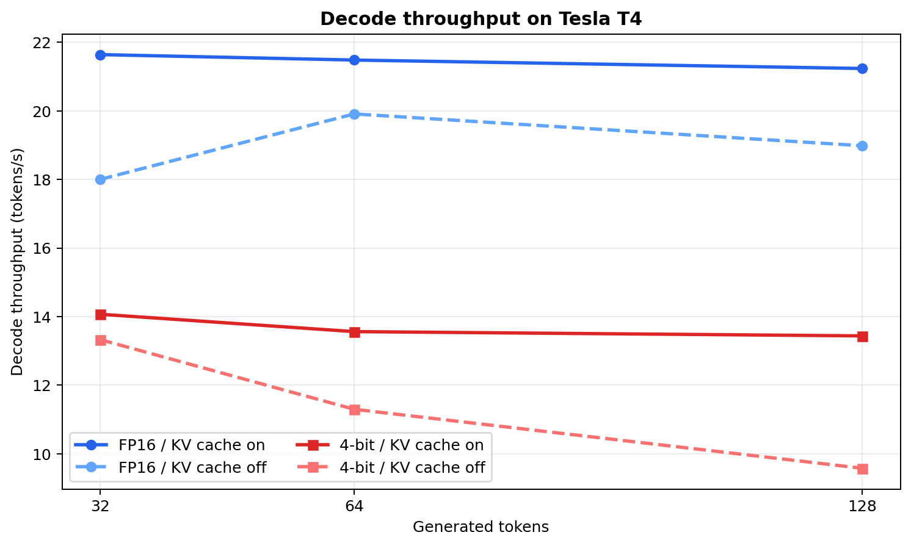
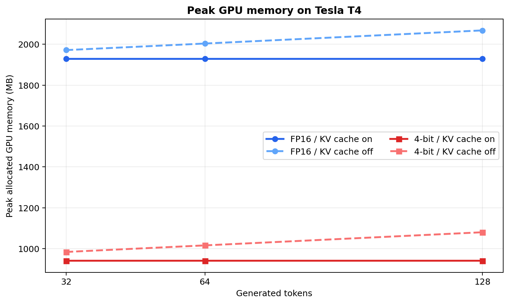

# Gemma 3 核心架构复现与高效推理

[](https://colab.research.google.com/github/zmh2245749337/gemma-inference-eval/blob/main/notebooks/Gemma3_Core_Alignment_Colab.ipynb)
[](https://colab.research.google.com/github/zmh2245749337/gemma-inference-eval/blob/main/notebooks/Gemma_Inference_Eval_Colab.ipynb)

本项目围绕 `google/gemma-3-1b-it` 完成一条可验证的白盒推理链路：用原生 PyTorch 复现 Gemma 3 文本 Decoder，将官方权重载入独立实现进行逐层数值对齐，再研究 KV Cache 与 4-bit 量化在 Tesla T4 上的性能—显存—质量权衡。

项目不是从零预训练，也不把 20 道自建题包装成通用模型评测。主线是：

> 核心结构复现 → 官方权重数值对齐 → 自定义 Hybrid KV Cache → FP16/4-bit 推理基准 → 固定任务回归检查

## 做了什么

### 1. 白盒复现 Gemma 3 1B 文本 Decoder

`src/gemma_eval/gemma3_core.py` 不调用 Transformers 的 Gemma 3 前向过程，独立实现：

- Gemma 风格 `(1 + weight)` RMSNorm 与 Q/K Norm；
- 局部/全局两套 RoPE 基频；
- 4 个 Query Head、1 个 KV Head 的 Multi-Query Attention；
- 5 层 Sliding Window + 1 层 Global Attention 的交替结构；
- GeGLU FFN 与四次 RMSNorm 的残差顺序；
- 局部层裁剪、全局层保留历史的 Hybrid KV Cache；
- 26 层完整文本主干、词嵌入和共享 LM Head。

默认配置对应 Gemma 3 1B：26 层、hidden size 1152、intermediate size 6912、4 个 Query Heads、1 个 KV Head、head dim 256、sliding window 512。

### 2. 官方权重与数值对齐

脚本将 `google/gemma-3-1b-it` 权重复制进独立 PyTorch 模型，同时运行两条前向链路，比较：

- 第 0 层：Sliding Attention；
- 第 5 层：Global Attention；
- 第 25 层：深层 Sliding Attention；
- 最后一个 token 的完整 logits 与 top-1 token。

输出最大绝对误差、平均绝对误差、余弦相似度、`allclose` 与 top-1 是否一致。这样可以区分“代码结构像”与“计算行为真的一致”。

```bash
python scripts/run_core_alignment.py \
  --precision fp16 \
  --layers 0 5 25 \
  --output reports/core_alignment.json
```

> 当前仓库已经实现对齐流程；官方权重对齐的具体数值需要在 Colab GPU 实际运行后写入，仓库不会预填未验证指标。

### 3. 推理生成与优化

- 手写 greedy、temperature、Top-K、Top-P 自回归生成；
- 手写循环与 Hugging Face `model.generate` 做 token 级一致性检查；
- 分离 prefill/TTFT 与 decode 吞吐量；
- 比较 KV Cache 开关、生成长度和 FP16/4-bit 精度；
- 保存硬件、软件版本、参数、随机种子和原始输出。

## Tesla T4 已验证结果

2026-08-11 在 Colab Tesla T4 完成第一轮实验，固定 `batch_size=1`、相同提示词、1 次预热和 3 次正式重复：

- 手写 greedy 解码与 Hugging Face `model.generate` 的新 token ID 完全一致；
- 生成 128 tokens 时，KV Cache 使 FP16 decode 吞吐量提升 **11.9%**，使 4-bit 吞吐量提升 **40.3%**；
- 4-bit 相比 FP16 的峰值显存下降 **51.2%**，但开启 Cache 时 decode 吞吐量下降约 **35.0%–36.9%**；
- 20 条固定中文任务上，FP16 通过 `11/20`，4-bit 通过 `6/20`。该结果只用于当前任务集的回归检查，不代表通用模型能力。





完整方法、原始数据、失败样例和适用边界见[首轮 T4 实验报告](reports/t4_20260811/REPORT.md)。

## 为什么这个项目不再以“评测”为主

评测仍然有价值，但它在这里是验证手段：证明重写的生成逻辑、Cache 和量化配置有没有改变结果。项目的技术主体已经下沉到模型内部，招聘者可以沿着“RMSNorm → RoPE → MQA → Mask → Decoder Block → KV Cache → 数值对齐”逐层追问，而不是只看到调用 API 和统计通过率。

## 目录

```text
configs/                 固定中文回归任务集
docs/                    核心架构、实验设计与面试学习材料
notebooks/               核心对齐与推理基准的 Colab 入口
scripts/                 权重对齐、生成、基准与回归检查脚本
src/gemma_eval/          白盒模型、KV Cache、模型加载与生成代码
tests/                   不下载官方权重即可运行的结构和行为测试
reports/                 已复核的原始记录、图表和实验报告
```

## 快速开始

Gemma 需要先在 Hugging Face 同意模型许可，并在 Colab Secrets 添加 `HF_TOKEN`。不要把 Token 写进代码、截图或 GitHub。

推荐先点击 README 顶部的“核心架构对齐 Colab”，依次运行：

```bash
pip install -r requirements-colab.txt
pip install -e . --no-deps
pytest -q
python scripts/run_core_alignment.py --precision fp16 --layers 0 5 25
```

结构和对齐原理见[Gemma 3 核心架构复现说明](docs/Gemma3核心架构复现.md)。原来的推理实验入口仍保留在 `notebooks/Gemma_Inference_Eval_Colab.ipynb`。

## 简历使用边界

- 可以写：独立实现了哪些模块、怎样做官方权重对齐、已真实跑出的 T4 指标。
- 对齐脚本尚未运行前，不能写具体误差、余弦相似度或“完全一致”。
- 这是推理内核复现与实验项目，不是从零预训练、微调或生产级推理引擎。
- eager PyTorch 实现优先可读性与可验证性，不宣称快于 FlashAttention 或 Transformers 优化内核。

## 参考资料

- [Gemma 3 Technical Report](https://arxiv.org/abs/2503.19786)
- [Google Gemma 3 Model Card](https://ai.google.dev/gemma/docs/core/model_card_3)
- [Hugging Face Gemma 3 文档](https://huggingface.co/docs/transformers/main/en/model_doc/gemma3)
- [Transformers Gemma 3 源码](https://github.com/huggingface/transformers/blob/main/src/transformers/models/gemma3/modeling_gemma3.py)
