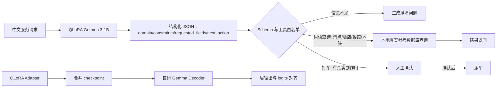

# Gemma-WorkOrder：小模型工具调用决策的QLoRA微调、安全约束与白盒验证

[](https://colab.research.google.com/github/zmh2245749337/gemma-workorder/blob/main/notebooks/Gemma_WorkOrder_Run_All_Colab.ipynb)
[](https://github.com/zmh2245749337/gemma-workorder/actions/workflows/ci.yml)

> Colab徽章目前仍链接到本项目早期版本（自建工单数据集）的一键运行notebook。当前主线任务（见下文）尚未做成对应的Colab notebook，需要在本地GPU上运行，见「快速复现」。

面向"让一个1B小模型可靠、安全地做工具调用决策"这一件事：使用4bit QLoRA将 `google/gemma-3-1b-it` 微调成能把一句中文话抽取成结构化查询意图、并在受控工具白名单和人工确认闸门下执行的模型。

**这个项目不是一个Agent**——它没有多步循环、没有记忆、不做自主任务规划。它是任何一个真正的Agent系统内部都需要的一个部件：给定一句话，判断该调用哪个工具、参数是什么、这件事能不能自动做还是要先让人确认。项目要证明的是这个部件本身能不能做扎实、做安全、做到可验证，而不是搭一个完整的Agent系统。

## 项目演进

最早这个项目是在一个自己搭的"设备运维工单"场景上验证这套架构（QLoRA微调 + 结构化输出校验 + 工具白名单 + 白盒Decoder数值对齐）。自建场景虽然可控，但终究是虚构数据，说服力有限。为了让整个实验建立在有外部效度的真实数据上，主线任务迁移到了 **CrossWOZ**——清华大学人机交互实验组（THU-CoAI）发布、论文发表于TACL的真实人工标注中文任务型对话数据集（Apache-2.0协议），架构完全不变，只是把"能不能安全地做工具调用决策"这件事换到了真实数据上验证。原始的工单版本完整保留在仓库里（`data/workorder/`、`*_workorder*` 系列脚本），作为这次迁移前的对照记录，不是被删除的废弃代码。

## 系统流程（当前主线：CrossWOZ 服务查询）



模型只负责理解请求、抽取字段、给出一个初步的路由建议；`route_tool` 不会盲信模型给的 `next_action`，会再检查一遍这个动作是否真的具备执行所需的信息（比如打车必须出发地和目的地都有），不满足就退回澄清，而不是猜。真实世界有副作用的动作（打车调度）在系统里永远先卡人工确认，`execute_local_tool` 不会替它自动执行。

**示例：安全闸门生效的一次真实运行**（`python scripts/run_service_query_demo.py --example taxi`，2026-08-24本地实测输出）——模型抽取出用户想从"乾清宫"打车去"姚记炒肝店（鼓楼店）"，并给出了合理的路由建议 `request_taxi`，但系统没有真的替他叫车：

```json
{
  "tool_call": {
    "name": "request_taxi",
    "arguments": { "出发地": "乾清宫", "目的地": "姚记炒肝店（鼓楼店）" }
  },
  "tool_result": null,
  "draft": {
    "status": "requires_human_confirmation",
    "safety_note": "查询结果来自本地真实参考数据（CrossWOZ）；打车类调度动作必须经人工确认后才会真正执行。"
  }
}
```

`tool_result` 固定是 `null`——不是没查到，是这类有真实副作用的动作根本没有被执行，`status` 明确停在 `requires_human_confirmation`，等人确认后才会真正派车。对照的只读查询例子（`--example restaurant`）会直接返回真实餐馆记录，两者的差异就是安全分级在实际运行时的样子。

## 任务与数据：CrossWOZ

[CrossWOZ](https://github.com/thu-coai/CrossWOZ)（THU-CoAI, *TACL* 2020, Apache-2.0）是一个真实的、人工标注的中文跨领域任务型对话数据集：6,012条真实对话、10万+句真实话语，覆盖北京本地生活服务五个领域——景点、酒店、餐馆、地铁、出租车，每一句话都由人工标注了意图、领域、槽位和取值。数据集自带每个领域的真实参考数据库（465个真实景点、1,133家真实酒店、951家真实餐馆）。

本项目把CrossWOZ的多轮对话转换成和原work-order版本一致的单轮训练形状："一句话 → 结构化字段 → 路由决策"，具体做了三件事，都写在 `scripts/build_service_query_dataset.py` 里：

- **拆成单轮**：CrossWOZ是多轮对话，但训练目标是单轮抽取。直接把每一轮user话语单独拿出来会有问题——后续轮次经常指代前文（比如"该景点的评分是多少"没有点名具体是哪个景点），脱离上下文单独训练会导致标签和文本对不上。脚本只保留对话的开场白，或者这句话本身就点名了具体查询条件的轮次，两者都是不依赖前文就能理解的，其余的丢弃。
- **均衡采样**：CrossWOZ里三个热门领域（景点/酒店/餐馆）的样本天然比地铁、打车、"信息不够要澄清"多得多。如果直接随机采样，训练集会严重偏科，某些路由甚至可能覆盖不到（工单版本就踩过这个坑：`query_asset_history`这条路由训练数据里从来没出现过）。脚本按 `next_action` 的六种取值做分层抽样，保证每种路由在训练/验证/测试集里都有均衡的样本量。
- **`next_action` 是本项目自己的设计，不是CrossWOZ原始标注**：CrossWOZ的对话行为标签只有Inform/Request/Recommend/NoOffer/Select/General，用来描述"说了什么"，没有标注"系统接下来该做什么"。把领域查询映射到对应的只读工具、把打车映射到需要人工确认的动作，这套路由和安全分级是本项目在真实数据之上自己设计、自己实现的。

处理后的规模：过滤后干净可用的单轮样本训练集23,738条、验证集2,318条、测试集2,374条（这是真实数据经过筛选后的规模）。用于实际QLoRA训练的是从中按六种路由均衡抽样出的子集：训练集300条、验证集291条、测试集300条，每种路由约50条。真实参考数据库同样做了裁剪，只保留训练数据里实际提到过的真实条目：48个真实景点、47家真实酒店、59家真实餐馆（`data/service_query/reference/`），既保持数据真实，又不需要把CrossWOZ完整的~2500条条目全部塞进仓库。

## 已验证结果

### CrossWOZ场景（当前主版本）

2026-08-24 在本地 NVIDIA GeForce RTX 3060 Laptop（6GB）上，使用CrossWOZ衍生的300条训练样本完成3轮QLoRA微调（`train_loss` 从3.657降到0.2669，验证集`eval_loss`从0.102降到0.0776，训练过程未出现过拟合回升），随后分别评测微调前后的模型在300条测试集上的表现：

| 指标 | Base Gemma（4bit） | QLoRA Gemma（4bit） |
| --- | ---: | ---: |
| JSON 合法率 | 0.00% | **100.00%** |
| 字段精确率 | 0.00% | **85.40%** |
| 工具路由准确率 | 0.00% | **88.33%** |
| 完整记录精确率 | 0.00% | **61.67%** |

Base模型的0%不是评测代码的问题：检查了base模型的原始输出，它习惯性地把JSON包在```` ```json ```` markdown代码块里（有时甚至没学会在哪里停下来，一次生成里连续输出两段JSON）、把`constraints`这个本该是字典的字段写成了纯字符串列表、把`domain`写成"出租车"这种不在五选一枚举里的近义词——这些正是QLoRA微调要解决的问题（格式稳定输出、结构对齐、枚举值收敛），微调后的模型在这三件事上都做对了，是JSON合法率从0到100%最直接的原因。字段精确率和完整记录精确率没有到100%，说明微调后的模型格式已经完全学会、但在少数具体取值（比如某些约束条件的具体文本）上还有识别偏差，这是真实模型能力的边界，不是格式问题。

同一天，针对这次训练出的CrossWOZ adapter重新跑了一遍白盒Decoder数值对齐（方法见下方「实现内容」第4步）：Layer 0/5/25 最大/平均绝对误差均为`0.0`，余弦相似度均在0.9999998以上；最后一个token的完整logits最大/平均绝对误差均为`0.0`，余弦相似度0.99999994，官方实现与自研Decoder的top-1 token ID完全一致，均为`57137`。结果与早期工单版本adapter的对齐结果一致，证明白盒复现的正确性不依赖具体训练任务，换了adapter、换了训练数据，数值对齐结论依然成立。完整报告见 `reports/service_query_merged_core_alignment.json`。

### 早期版本（自建工单数据集，历史记录）

2026-08-13 在 Google Colab Tesla T4 上，使用自建的90条中文工单样本完成实验：

| 指标 | Base Gemma（4bit） | QLoRA Gemma（4bit） |
| --- | ---: | ---: |
| JSON 合法率 | 28.57% | **100.00%** |
| 字段精确率 | 60.00% | **98.57%** |
| 受控动作路由准确率 | 14.29% | **100.00%** |
| 完整记录精确率 | 0.00% | **85.71%** |

2026-08-24 在本地 NVIDIA GeForce RTX 3060（6GB）上完整重跑了同一份工单数据的QLoRA微调与评测流程，结果与上表Colab结果完全一致（验证loss 0.0191 vs. 原始0.0200，同量级），证明了固定种子+确定性数据生成+贪心解码下这套流程具备跨硬件的可复现性。这套结果对应的是已经被CrossWOZ取代的早期自建数据集，保留在这里作为迁移前的对照记录，不代表当前主线任务的表现。详见 [Gemma-WorkOrder 实验报告](reports/workorder_experiment_20260813/REPORT.md)。

## 实现内容

下面四步是按能力递进的顺序排列的：**看懂**生成与推理的底层机制 → **改造**出一个专用小模型 → **管住**它的输出边界 → **验证**改造后的权重计算是否仍然正确。每一步都建立在上一步之上，不是互相独立的实验清单；这四步的顺序和目的不因具体任务场景（工单还是CrossWOZ服务查询）而改变。

### 1.【看懂】生成原理与推理工程

- 手写 greedy、temperature、Top-K、Top-P 自回归生成；
- 手写生成与 Hugging Face `model.generate` 做 token 级一致性检查；
- 拆分 TTFT、decode tokens/s 与峰值显存；
- 对比 KV Cache 开关、FP16 和 4bit 路径。

生成 128 tokens 时，KV Cache 使 FP16 decode 吞吐提升 11.9%、4bit 提升 40.3%；4bit 相比 FP16 峰值显存下降 51.2%。完整实验和限制见 [Tesla T4 实验报告](reports/t4_20260811/REPORT.md)。这一步是后面所有改造和验证的地基，跟具体任务场景无关：不理解生成循环、KV Cache 和量化的真实影响，QLoRA 微调和白盒复核都无从谈起。

### 2.【改造】结构化查询意图抽取与QLoRA任务适配

- 定义查询领域、用户给定的约束条件、用户想要的信息、缺失字段和下一步动作五个字段（`ServiceQueryFields`，见 `src/gemma_eval/service_query.py`）；
- 基于CrossWOZ真实对话构建可复现的单轮训练数据（见上方「任务与数据」），保留Base-vs-QLoRA同集对照；
- 使用 Transformers、PEFT 和 bitsandbytes 加载 Gemma 3-1B，采用 4bit NF4 与 LoRA，目标覆盖 `q/k/v/o` 和 FFN 投影层；
- 只对目标 JSON 答案计算训练损失，Prompt token 使用 label mask；
- 保存 Adapter、Tokenizer、训练参数和验证损失。

把一个通用的 1B 小模型改造成只会做"抽取查询意图 + 给出路由建议"这一件窄任务、格式稳定的专用模型。

### 3.【管住】结构化输出与安全边界

- 从模型文本中提取单个 JSON 对象；
- 校验字段类型、未知字段、`next_action` 枚举和工具白名单；
- `route_tool` 不盲信模型给出的 `next_action`，会核对这个动作是否具备执行所需的信息，不满足就退回澄清；
- 只读查询类工具（景点/酒店/餐馆/地铁）只执行本地真实参考数据的只读查询；
- 打车这类有真实副作用的动作，结果固定标记为需要人工确认，`execute_local_tool` 不会替它自动执行。

模型改造完成不代表可以信任它的输出——这一步给模型的产出划出它不能越过的边界，事实性知识始终来自本地真实参考数据，不是模型自己编的；会产生真实后果的动作，决定权也不在模型手里。

### 4.【验证】Adapter 合并与白盒复核

项目保留了原生 PyTorch 实现的 Gemma 3 1B 文本 Decoder，包括 RMSNorm、Q/K Norm、RoPE、Multi-Query Attention、Sliding/Global Attention、GeGLU FFN 与 Hybrid KV Cache。

将 QLoRA Adapter 合并为 Hugging Face checkpoint 后，再加载进自研 Decoder，与 Transformers 前向结果比较：

- Layer 0、5、25 的最大/平均绝对误差均为 `0.0`；
- 最后一个 token 的完整 logits 最大/平均绝对误差均为 `0.0`；
- 官方实现与自研 Decoder 的 top-1 token ID 均为 `57137`。

以上数字同时在早期工单版本adapter和当前CrossWOZ版本adapter（`artifacts/service_query_qlora_adapter`）上复现，两次结果一致——这一步本身跟任务场景、训练数据无关，验证的是"QLoRA权重合并进checkpoint之后，计算链路还是不是原来那套官方实现"，跟具体任务学到了什么无关，所以换任务、重新训练之后结论依然成立。白盒实现的作用是验证合并权重与计算链路，而不是替代成熟的生产推理引擎——"微调后的权重合并对不对"这件事，这一步不依赖对框架的信任，而是自己动手证明。实现细节见 [Gemma 3 核心架构说明](docs/Gemma3核心架构复现.md)。

## 快速复现

### 方式一：Colab 一键运行（早期工单版本）

点击 README 顶部的 WorkOrder Colab 徽章，运行的是早期自建工单数据集版本，不是当前的CrossWOZ主线任务。

### 方式二：本地 GPU（当前 CrossWOZ 主线任务）

**准备 Hugging Face 访问令牌**（二选一，脚本会自动按顺序尝试）：

- 运行一次 `huggingface-cli login`（或较新版本的 `hf auth login`）；或
- 复制 `.env.example` 为 `.env`，填入在 [huggingface.co/settings/tokens](https://huggingface.co/settings/tokens) 创建的 `HF_TOKEN`。

两种方式都需要先在 [google/gemma-3-1b-it 模型页](https://huggingface.co/google/gemma-3-1b-it) 接受许可协议。

本地运行不下载模型的安全基线：

```bash
pip install -e .
python scripts/run_service_query_demo.py --example restaurant
python scripts/run_service_query_demo.py --example taxi
pytest -q
```

完整 GPU 链路（`data/service_query/*.jsonl` 已经在仓库里，不需要重新生成；如果想改抽样策略重新生成，需要先 `git clone https://github.com/thu-coai/CrossWOZ` 到本地，再用 `--crosswoz-dir` 指向它的 `data/crosswoz` 目录）：

```bash
python scripts/evaluate_service_query.py --precision 4bit --output reports/service_query_base_4bit.json
python scripts/train_service_query_qlora.py --output-dir artifacts/service_query_qlora_adapter
python scripts/evaluate_service_query.py --adapter artifacts/service_query_qlora_adapter --output reports/service_query_qlora_4bit.json
python scripts/merge_workorder_adapter.py --adapter artifacts/service_query_qlora_adapter --output-dir artifacts/service_query_merged
python scripts/run_core_alignment.py --model-id artifacts/service_query_merged --precision fp16 --output reports/service_query_merged_core_alignment.json
```

> Windows 本地 GPU 补充说明：`bitsandbytes`（4bit 量化依赖）在少数 Windows 环境下安装或加载不稳定。如果 `--precision 4bit` 报错，先把 `evaluate_service_query.py` 换成 `--precision fp16` 跑通整条链路确认逻辑无误，再单独排查 4bit/bitsandbytes 的安装问题；训练脚本本身固定用 4bit QLoRA，这是项目要验证的方案，不建议为绕过安装问题改成全精度训练。

## 项目结构

```text
src/gemma_eval/
├─ service_query.py         当前主线：Schema、校验、路由、真实数据库查询和安全闸门
├─ service_query_data.py    当前主线：Prompt、JSONL 与任务指标
├─ workorder.py             早期版本：工单 Schema、校验、路由、SQLite 工具（保留作为对照）
├─ workorder_data.py        早期版本：Prompt、JSONL 与任务指标（保留作为对照）
├─ workorder_inference.py   Gemma 工单推理适配器
├─ gemma3_core.py           白盒 Gemma Decoder 与 Hybrid KV Cache
├─ decoding.py              手写自回归生成
└─ modeling.py              Transformers 模型加载

scripts/                    数据、训练、评测、合并、API 与对齐入口（service_query_* 为当前主线）
notebooks/                  一键 WorkOrder（早期版本）、白盒对齐和推理实验 Colab
reports/                    真实运行记录、图表与实验报告
docs/                       系统设计、架构原理和操作说明
tests/                      Decoder、生成、WorkOrder（早期）与 ServiceQuery（当前主线）单元测试
data/
├─ service_query/           当前主线：CrossWOZ 衍生数据 + 真实参考数据库子集
└─ workorder/                早期版本：自建工单数据（保留作为对照）
```

## 文档与证据

- [Gemma-WorkOrder 设计与实现](docs/Gemma_WorkOrder设计与实现.md)
- [Gemma-WorkOrder 实验报告（早期工单版本）](reports/workorder_experiment_20260813/REPORT.md)
- [Gemma-WorkOrder Colab 操作（早期工单版本）](docs/Gemma_WorkOrder_Colab操作.md)
- [Gemma 3 核心架构复现说明](docs/Gemma3核心架构复现.md)
- [Tesla T4 推理实验报告](reports/t4_20260811/REPORT.md)
- [原始核心对齐记录（早期工单版本adapter）](reports/core_alignment_20260812/core_alignment.json)
- [核心对齐记录（当前CrossWOZ版本adapter）](reports/service_query_merged_core_alignment.json)
- [CrossWOZ 论文与仓库](https://github.com/thu-coai/CrossWOZ)

## 适用边界

- CrossWOZ本身是真实人工标注数据，但本项目做了单轮简化（丢弃依赖前文的指代性轮次）和领域裁剪（真实参考数据库只保留训练集实际用到的条目），不是完整还原CrossWOZ的多轮对话状态跟踪能力；
- `next_action` 路由和人工确认分级是本项目自己的安全设计，不是CrossWOZ原始标注的一部分；
- 六种路由的训练/测试样本经过分层抽样人为拉平，不代表真实用户请求里这六种情况的自然分布；
- 模型不独立做业务决策（比如不会自己判断该不该打车），只负责抽取意图和给出路由建议，最终执行权在系统的校验和确认逻辑手里；
- 本地工具查询提供的是CrossWOZ真实数据的裁剪子集，不是接入真实营业中的北京商户信息（地址电话等信息真实存在于CrossWOZ语料里，但不保证当前仍然准确、仍在营业）；
- 自研 Decoder 是可读、可验证的 eager PyTorch 实现，不宣称快于 vLLM、FlashAttention 或 Transformers 优化内核；
- 仓库不提交 Hugging Face Token、基础模型、Adapter 或合并权重。

## 参考资料

- [Gemma 3 Technical Report](https://arxiv.org/abs/2503.19786)
- [Google Gemma 3 Model Card](https://ai.google.dev/gemma/docs/core/model_card_3)
- [Hugging Face Gemma 3 文档](https://huggingface.co/docs/transformers/main/en/model_doc/gemma3)
- [CrossWOZ: A Large-Scale Chinese Cross-Domain Task-Oriented Dialogue Dataset (TACL 2020)](https://github.com/thu-coai/CrossWOZ)
