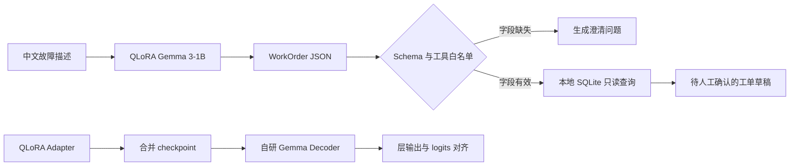

# Gemma-WorkOrder：Gemma 3-1B QLoRA 工单结构化与受控工具调用

[](https://colab.research.google.com/github/zmh2245749337/gemma-workorder/blob/main/notebooks/Gemma_WorkOrder_Run_All_Colab.ipynb)
[](https://colab.research.google.com/github/zmh2245749337/gemma-workorder/blob/main/notebooks/Gemma3_Core_Alignment_Colab.ipynb)

面向设备运维记录的轻量级本地大模型原型：使用 4bit QLoRA 将 `google/gemma-3-1b-it` 适配为中文工单结构化模型，经 JSON Schema 与工具白名单校验后查询本地可信数据，最终只生成待人工确认的工单草稿。

项目不是工业故障诊断系统，也不是从零训练大模型。它的完整主线是：

> 工单数据构建 → QLoRA 任务适配 → 结构化输出校验 → 本地只读工具调用 → 人工确认草稿 → 合并权重的白盒 Decoder 复核

## 系统流程



模型负责理解、字段抽取和受控动作选择；设备事实来自本地 SQLite 参考表。系统没有自动写入、派单或维修执行工具。

## 已验证结果

2026-08-13 在 Google Colab Tesla T4 上，使用 90 条固定随机种子（42）的受控自建样本完成实验，训练/验证/测试集分别为 62 / 14 / 14。

| 指标 | Base Gemma（4bit） | QLoRA Gemma（4bit） |
| --- | ---: | ---: |
| JSON 合法率 | 28.57% | **100.00%** |
| 字段精确率 | 60.00% | **98.57%** |
| 受控动作路由准确率 | 14.29% | **100.00%** |
| 完整记录精确率 | 0.00% | **85.71%** |

训练采用 4bit NF4 QLoRA，3 epoch，约 109.6 秒；最终 train loss 为 `0.0227`，validation loss 为 `0.0200`。任务指标的定义、环境与边界见 [Gemma-WorkOrder 实验报告](reports/workorder_experiment_20260813/REPORT.md)。

> 受控动作路由指标只覆盖当前 14 条测试样本中的“查询故障码”和“请求补充信息”，不代表复杂多工具 Agent 的泛化能力。

## 实现内容

### 1. 工单 Schema 与数据管线

- 定义设备名称、设备类型、故障码、现象、时间、已采取操作、缺失字段和下一步动作；
- 使用固定随机种子生成 90 条可复现的中文受控样本；
- 固定训练、验证和测试划分，保留 Base-vs-QLoRA 同集对照；
- 训练数据属于自建演示数据，不冒充企业生产数据。

### 2. QLoRA 任务适配

- 使用 Transformers、PEFT 和 bitsandbytes 加载 Gemma 3-1B；
- 采用 4bit NF4 与 LoRA，目标覆盖 `q/k/v/o` 和 FFN 投影层；
- 只对目标 JSON 答案计算训练损失，Prompt token 使用 label mask；
- 保存 Adapter、Tokenizer、训练参数和验证损失。

### 3. 结构化输出与安全边界

- 从模型文本中提取单个 JSON 对象；
- 校验字段类型、未知字段、`next_action` 枚举和工具白名单；
- 支持故障码查询、设备历史查询和缺失信息澄清的受控系统路径；
- 工具仅执行本地 SQLite 只读查询；
- 最终结果固定标记为 `draft_requires_human_confirmation`。

### 4. Adapter 合并与白盒复核

项目保留了原生 PyTorch 实现的 Gemma 3 1B 文本 Decoder，包括 RMSNorm、Q/K Norm、RoPE、Multi-Query Attention、Sliding/Global Attention、GeGLU FFN 与 Hybrid KV Cache。

将 QLoRA Adapter 合并为 Hugging Face checkpoint 后，再加载进自研 Decoder，与 Transformers 前向结果比较：

- Layer 0、5、25 的最大/平均绝对误差均为 `0.0`；
- 最后一个 token 的完整 logits 最大/平均绝对误差均为 `0.0`；
- 官方实现与自研 Decoder 的 top-1 token ID 均为 `57137`。

白盒实现的作用是验证合并权重与计算链路，而不是替代成熟的生产推理引擎。实现细节见 [Gemma 3 核心架构说明](docs/Gemma3核心架构复现.md)。

### 5. 推理与部署实验

原有 T4 实验作为应用主线的工程支撑保留：

- 手写 greedy、temperature、Top-K、Top-P 自回归生成；
- 手写生成与 Hugging Face `model.generate` 做 token 级一致性检查；
- 拆分 TTFT、decode tokens/s 与峰值显存；
- 对比 KV Cache 开关、FP16 和 4bit 路径。

生成 128 tokens 时，KV Cache 使 FP16 decode 吞吐提升 11.9%、4bit 提升 40.3%；4bit 相比 FP16 峰值显存下降 51.2%。完整实验和限制见 [Tesla T4 实验报告](reports/t4_20260811/REPORT.md)。

## 快速复现

最简单的方式是点击 README 顶部的 WorkOrder Colab 徽章，选择 T4 GPU，并在 Colab Secrets 中配置有 Gemma 访问权限的 `HF_TOKEN`，然后选择“运行时 → 全部运行”。

本地运行不下载模型的安全基线：

```bash
pip install -e .
python scripts/run_workorder_demo.py --output reports/workorder_phase_a_demo.json
pytest -q
```

完整 GPU 链路：

```bash
python scripts/build_workorder_dataset.py --output-dir data/workorder --samples 90 --seed 42
python scripts/evaluate_workorder.py --precision 4bit --output reports/workorder_base_4bit.json
python scripts/train_workorder_qlora.py --output-dir artifacts/workorder_qlora_adapter
python scripts/evaluate_workorder.py --adapter artifacts/workorder_qlora_adapter --output reports/workorder_qlora_4bit.json
python scripts/merge_workorder_adapter.py --adapter artifacts/workorder_qlora_adapter --output-dir artifacts/workorder_merged
python scripts/run_core_alignment.py --model-id artifacts/workorder_merged --precision fp16 --output reports/workorder_merged_core_alignment.json
```

## 项目结构

```text
src/gemma_eval/
├─ workorder.py             工单 Schema、校验、路由、SQLite 工具和草稿
├─ workorder_data.py        Prompt、JSONL 与任务指标
├─ workorder_inference.py   Gemma 工单推理适配器
├─ gemma3_core.py           白盒 Gemma Decoder 与 Hybrid KV Cache
├─ decoding.py              手写自回归生成
└─ modeling.py              Transformers 模型加载

scripts/                    数据、训练、评测、合并、API 与对齐入口
notebooks/                  一键 WorkOrder、白盒对齐和推理实验 Colab
reports/                    真实运行记录、图表与实验报告
docs/                       系统设计、架构原理和操作说明
tests/                      Decoder、生成与 WorkOrder 单元测试
```

## 文档与证据

- [Gemma-WorkOrder 设计与实现](docs/Gemma_WorkOrder设计与实现.md)
- [Gemma-WorkOrder 实验报告](reports/workorder_experiment_20260813/REPORT.md)
- [Gemma-WorkOrder Colab 操作](docs/Gemma_WorkOrder_Colab操作.md)
- [Gemma 3 核心架构复现说明](docs/Gemma3核心架构复现.md)
- [Tesla T4 推理实验报告](reports/t4_20260811/REPORT.md)
- [原始核心对齐记录](reports/core_alignment_20260812/core_alignment.json)

## 适用边界

- 90 条数据来自受控模板，测试集规模仅 14 条，指标只说明窄任务上的格式与字段适配效果；
- 当前结果不能证明开放领域泛化，也不能外推到真实企业设备和故障分布；
- 模型不独立诊断故障，不给出维修决策，不自动提交工单；
- 本地工具查询提供的是演示性可信数据，不是企业资产系统；
- 自研 Decoder 是可读、可验证的 eager PyTorch 实现，不宣称快于 vLLM、FlashAttention 或 Transformers 优化内核；
- 仓库不提交 Hugging Face Token、基础模型、Adapter 或合并权重。

## 参考资料

- [Gemma 3 Technical Report](https://arxiv.org/abs/2503.19786)
- [Google Gemma 3 Model Card](https://ai.google.dev/gemma/docs/core/model_card_3)
- [Hugging Face Gemma 3 文档](https://huggingface.co/docs/transformers/main/en/model_doc/gemma3)
