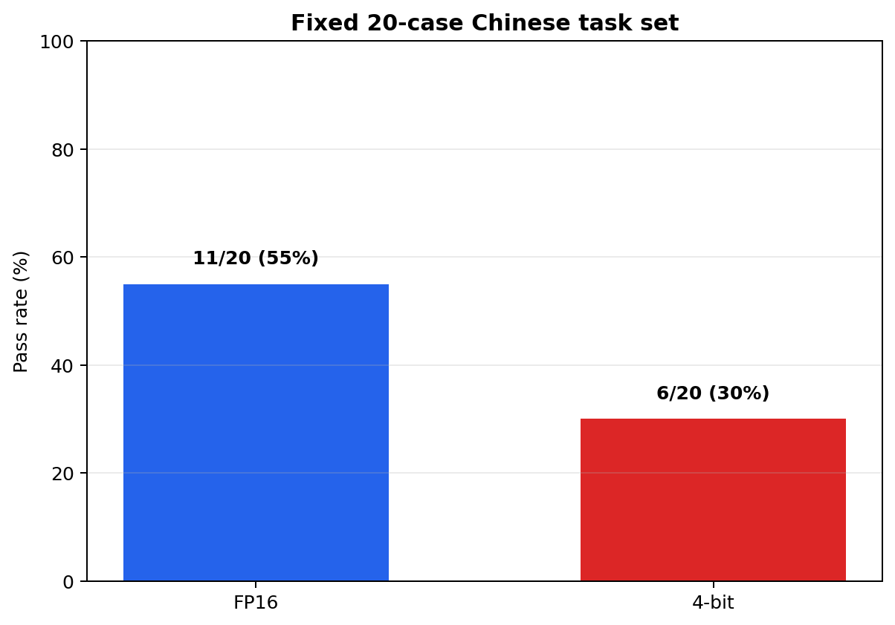

# Tesla T4 首轮实验报告

## 结论摘要

本报告使用 `google/gemma-3-1b-it` 验证手写解码正确性，并比较 KV Cache、FP16 与 bitsandbytes 4-bit 在 Colab Tesla T4 上的性能和固定题集表现。

1. 手写 greedy 解码与 Hugging Face `model.generate` 的新 token ID 完全一致，验证了生成循环实现的正确性。
2. KV Cache 在6组同条件对比中均提高了解码吞吐量。生成128 tokens时，FP16提升11.9%，4-bit提升40.3%。
3. 4-bit 将开启 Cache 时的峰值显存从约1928 MB降至941 MB，下降51.2%；但解码吞吐量下降35.0%–36.9%，TTFT增加63.2%–79.4%。
4. 当前20条固定中文任务上，FP16通过11条，4-bit通过6条。5条回归涉及计算、抽取、格式遵循、LLM基础知识和逻辑判断。

因此，在本次 `Gemma 3 1B + Tesla T4 + batch_size=1` 条件下，如果约2 GB模型推理显存可以接受，FP16是更合适的默认选择；4-bit更适合显存容量优先、且能够接受延迟和当前任务集质量风险的场景。

## 实验环境

| 项目 | 值 |
|---|---|
| GPU | Tesla T4，约15 GB显存 |
| 模型 | `google/gemma-3-1b-it` |
| Python | 3.12.13 |
| PyTorch | 2.11.0+cu128 |
| Transformers | 5.13.1 |
| Accelerate | 1.14.0 |
| bitsandbytes | 0.50.0 |
| CUDA（PyTorch） | 12.8 |
| Batch size | 1 |
| 性能提示词 tokens | 24 |
| 生成长度 | 32、64、128 tokens |
| 预热/正式重复 | 1次/3次，报告中位数 |
| 解码策略 | Greedy，固定 seed=42，不遇 EOS 提前停止 |
| 4-bit配置 | NF4、double quant、FP16计算类型 |

首轮 CSV/JSONL 未自动写入 Accelerate 和 bitsandbytes 版本；实验结束后在同一 Colab 会话中补充读取，记录见 [`environment_addendum.json`](environment_addendum.json)。代码已增加自动记录字段，后续运行无需手工补充。

## 1. 手写解码正确性

`manual_generate` 不调用 `model.generate`，而是逐步完成前向计算、选择下一个 token、拼接序列并更新 KV Cache。在相同提示词和 greedy 参数下：

| 指标 | 结果 |
|---|---:|
| 生成 tokens | 48 |
| TTFT | 766.79 ms |
| 端到端吞吐量 | 15.29 tokens/s |
| 与 HF greedy 新 token ID 一致 | **True** |

这次运行用于正确性校验；其计时包含手写 Python 循环，不与后面的正式基准直接比较。

## 2. KV Cache 性能

| 精度 | 生成 tokens | Cache开启 TPS | Cache关闭 TPS | Cache吞吐提升 |
|---|---:|---:|---:|---:|
| FP16 | 32 | 21.64 | 18.00 | 20.2% |
| FP16 | 64 | 21.48 | 19.91 | 7.9% |
| FP16 | 128 | 21.24 | 18.98 | 11.9% |
| 4-bit | 32 | 14.07 | 13.33 | 5.6% |
| 4-bit | 64 | 13.56 | 11.30 | 20.1% |
| 4-bit | 128 | 13.44 | 9.57 | 40.3% |

开启 Cache 后，解码速度随生成长度基本稳定；关闭 Cache 时，4-bit吞吐量从13.33 tokens/s降至9.57 tokens/s。FP16的32 tokens结果存在一定短任务波动，因此不声称其提升随长度严格单调增长。

## 3. 显存与量化权衡

| 生成 tokens | FP16 Cache开启显存 | 4-bit Cache开启显存 | 显存下降 | 4-bit吞吐变化 |
|---|---:|---:|---:|---:|
| 32 | 1928 MB | 941 MB | 51.2% | -35.0% |
| 64 | 1928 MB | 941 MB | 51.2% | -36.9% |
| 128 | 1928 MB | 941 MB | 51.2% | -36.7% |

模型 footprint 估计由 FP16的1907 MB降至4-bit的909 MB。关闭 Cache 时，峰值显存会随生成长度增加；在128 tokens下达到FP16 2068 MB、4-bit 1080 MB。

本实验说明量化首先解决容量问题，并不保证低延迟。对于1B小模型和T4，量化计算核及反量化开销可能抵消低位宽带来的计算收益。

## 4. 固定题集质量检查

| 精度 | 通过数 | 通过率 |
|---|---:|---:|
| FP16 | 11/20 | 55% |
| 4-bit | 6/20 | 30% |

FP16通过而4-bit失败的5条样例为：

- `math_02`：长方形面积，FP16回答40，4-bit回答12；
- `extract_03`：框架抽取，4-bit将 PyTorch 错提取为“项目”；
- `format_02`：编号格式约束，4-bit未按要求输出；
- `llm_03`：RMSNorm与LayerNorm差异，4-bit未包含关键点“均值”；
- `logic_01`：三段论判断，FP16回答“是”，4-bit回答“否”。

这些差异不只是标点或同义表达造成的判分误差，但仍不能据此推出4-bit在通用任务上必然下降25个百分点。

## 5. 适用边界

- 只测试了单次 Colab T4 会话、单个模型和 `batch_size=1`；
- 性能测试只使用一个24-token中文提示词，每组正式重复3次；
- 20条题目是项目内的客观回归集，不是 MMLU、C-Eval 等正式基准；
- 自动判分使用关键词包含规则，不能覆盖开放式回答质量；
- 未测试多并发、长上下文、服务化框架、CPU或其他GPU；
- 首轮 Accelerate 与 bitsandbytes 版本通过同一 Colab 会话补充记录，而非直接写入每条原始结果；后续代码已修复。

因此，所有结果都必须限定在本报告的模型、硬件、输入和软件环境内。

## 原始证据

- [`benchmark.csv`](benchmark.csv)：12条性能记录；
- [`manual_decode.json`](manual_decode.json)：手写解码参数、输出与一致性结果；
- [`quality_fp16.jsonl`](quality_fp16.jsonl)：FP16的20条逐题输出；
- [`quality_4bit.jsonl`](quality_4bit.jsonl)：4-bit的20条逐题输出；
- [`environment_addendum.json`](environment_addendum.json)：同一会话补录的软件版本；
- [`scripts/plot_results.py`](../../scripts/plot_results.py)：图表复现脚本。
